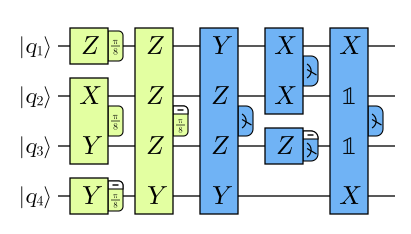

# PBC exchange format

Export an optimized circuit with:

```bash
tzap input.qasm --to-pbc -o output.pbc
```

Conversion runs after optimization and requested decompositions. Gate-circuit
inputs must have no resets. Measurements may appear anywhere, including
mid-circuit, with more gates after them. For Rz gates, also use
`--decompose-rz`. CCX and CCZ convert natively, into seven rotations
each, and need no decomposition flag.

Add `--pbc-opt` to optimize the PBC rotations after conversion (see
[PBC rotation optimization](pbc-optimize.md)).

## Drawing a PBC circuit

```bash
tzap input.qasm --visualize-pbc circuit.svg [--pbc-opt] [--to-pbc -o output.pbc]
```

writes an SVG drawing in the style of Litinski's "A Game of Surface Codes"
(Figs. 4 and 6). Each operation is one box spanning its qubits, with a
Pauli letter on every wire it covers (𝟙 inside the span where it acts
trivially). A tab on the right shows the angle (π/8, π/4, 3π/8 or π/2), with
a white "−" strip when the axis is negative. π/8-type rotations are green,
π/4 orange, π/2 grey and measurements blue. As in the paper, the output
Clifford (the `f` records) is not drawn.

For example, the circuit of the paper's Fig. 4
([`pbc-litinski-fig4.qasm`](pbc-litinski-fig4.qasm)) draws as



which matches the paper's bottom-right panel.

As in the paper, operations are drawn as early as their commutation allows:
each goes one column past the latest earlier operation it anticommutes with,
so only commuting operations change position. Circuits longer than 400
operations are drawn up to that point, with dotted wire ends. The library
call `PbcCircuit::to_svg_with(SvgOptions { .. })` also offers program-order
layout, full-height boxes (the paper's Fig. 6), register labels, the output
Clifford as a final box, and a different operation limit.

## Syntax

The first two lines declare the number of qubits and of classical registers,
each of which holds one bit:

```text
qubits 3
registers 2
```

Qubit IDs and register IDs start at zero. Multiple QASM `qreg`s or `creg`s are
numbered consecutively in declaration order, so with `creg a[1]; creg b[2];`,
`b[1]` becomes `c2`. The remaining lines contain `r` and `m` operations in
execution order, in any interleaving, followed by `f` (frame) records:

```text
r <k> <sign> <Pauli factors>
m <sign> <Pauli factors> -> c<register ID>
f <Xq or Zq> <sign> <Pauli factors>
```

- `r` applies `exp(-i * k*pi/8 * P)`, where `k` is an integer and `P` is the
  signed Pauli product. The exporter uses `k` from -3 through 4; angles differing
  by 8 are equivalent up to global phase.
- `m` measures `P`: eigenvalue +1 writes bit 0; eigenvalue -1 writes bit 1.
- The sign is `1` or `-1`. Signs `i` and `-i` are not allowed: rotation and
  measurement axes must be Hermitian.
- Factors are `X0`, `Y1`, `Z2`, etc., listed in increasing qubit-ID order, with
  each qubit appearing at most once. Omitted qubits carry identity; an empty
  factor list means identity.
- All factors on a line form **one joint operation**, not separate operations.
- Measurements write directly to registers such as `c0`. A later write to the
  same register overwrites its value. There are no separate measurement IDs.
- `f` records specify the complete output Clifford C by giving its images
  `C† Xq C` and `C† Zq C`. They are not individual gates. The Clifford C acts
  after all `r` and `m` operations and is unique up to global phase.
  An omitted row means the identity image (`Xq` or `Zq` with sign `1`).
  Export writes changed X rows in increasing q order, then changed Z rows in
  increasing q order. The rows must collectively describe a valid Clifford
  action; their signs are `1` or `-1`.

For example, `r 1 -1 X0 Z2` rotates by pi/8 about `-X0 Z2` (equivalently, by
-pi/8 about `X0 Z2`), and
`m -1 Z1 -> c0` measures `-Z1`, reversing the outcome labels of a Z measurement.

## Output semantics

PBC conversion preserves the **full quantum–classical channel** of the circuit
being converted: the joint classical-result distribution, the conditional quantum
output states on every wire (including measured wires), and their correlations.
This holds for arbitrary input states, including inputs entangled with an external
system. Global phase is unobservable. Any approximation introduced earlier by
Rz decomposition is separate from this exact conversion.

Measurements are nondestructive projective measurements. Conversion conjugates
their axes by the accumulated Clifford frame, then retains the **entire** frame
as terminal `f` records. Applying the represented Clifford restores the
quantum output states; discarding it generally preserves only classical
probabilities, not the full channel. No qubits or frame information are
automatically discarded, even when every input qubit is measured. Circuits
without measurements retain their frame too.

A measurement leaves the frame unchanged: it measures the current image of
`Zq`, and gates after it keep updating the same frame or emitting rotations
about its images. The output Clifford represented by the frame acts after all
operations. Resets, hidden measurement outcomes, and conditional operations
are not supported by this exchange format (see
[classical conditioning](pbc-classical-conditioning.md)).

## Examples with terminal input measurements

These examples give the direct transformation; optimization may simplify a
circuit further. The exported frame preserves quantum outputs as well as the
classical results.

### H followed by measurement

Input: `H q0; measure q0 -> c0`.

```text
qubits 1
registers 1
m 1 X0 -> c0
f X0 1 Z0
f Z0 1 X0
```

H changes the measurement axis from Z to X; the frame represents that final H.

### X followed by measurement

Input: `X q0; measure q0 -> c0`.

```text
qubits 1
registers 1
m -1 Z0 -> c0
f Z0 -1 Z0
```

X reverses the Z-measurement result; the frame represents that final X.

### A T rotation between two H gates

Input: `H q0; T q0; H q0; measure q0 -> c0`.

```text
qubits 1
registers 1
r 1 1 X0
m 1 Z0 -> c0
```

The T gate becomes an X-axis rotation, followed by Z measurement. The two
H gates cancel in the frame, so no `f` records are needed.

### Bell preparation and readout

Input: `H q0; CX q0 -> q1; measure q0 -> c0; measure q1 -> c1`.

```text
qubits 2
registers 2
m 1 X0 -> c0
m 1 X0 Z1 -> c1
f X0 1 Z0 X1
f Z0 1 X0
f Z1 1 X0 Z1
```

For input `|00>`, the classical outputs are `00` and `11`, each with probability
one half. The second instruction measures the joint product `X0 Z1`.
The frame restores the corresponding quantum outputs `|00>` and `|11>`.

### Partial readout

Input: `H q0; CX q0 -> q1; measure q1 -> c0` (one classical register).

```text
qubits 2
registers 1
m 1 X0 Z1 -> c0
f X0 1 Z0 X1
f Z0 1 X0
f Z1 1 X0 Z1
```

The frame represents both Cliffords, including the entangling CX. The state on unmeasured q0,
the state on measured q1, and their correlations with c0 are preserved.

## Examples with mid-circuit measurements

Rotations after a measurement appear after its `m` line, in execution order.
A rotation that does not commute with an earlier measurement must stay after
it; one that commutes could be reordered, but conversion never reorders.

### Measure, then continue on the same qubit

Input: `H q0; T q0; measure q0 -> c0; H q0; T q0; measure q0 -> c1`.

```text
qubits 1
registers 2
r 1 1 X0
m 1 X0 -> c0
r 1 1 Z0
m 1 Z0 -> c1
```

The first T becomes an X rotation. The second H returns the frame to the
identity, so the second T and the final measurement are plain Z operations,
and no `f` records are needed.

### Measure half of a Bell pair, then apply T to the other half

Input: `H q0; CX q0 -> q1; measure q0 -> c0; T q1; H q1; measure q1 -> c1`.

```text
qubits 2
registers 2
m 1 X0 -> c0
r 1 1 X0 Z1
m 1 X1 -> c1
f X0 1 Z0 X1
f X1 1 X0 Z1
f Z0 1 X0
f Z1 1 X1
```

After the measurement, the T on q1 becomes a joint rotation about `X0 Z1`,
including the already-measured q0. It commutes with the earlier `X0`
measurement.

### Parity check through an ancilla, then more T gates

Input: `H q0; T q0; CX q0 -> q2; CX q1 -> q2; measure q2 -> c0; H q0; T q0;
T q1; measure q0 -> c1`.

```text
qubits 3
registers 2
r 1 1 X0
m 1 X0 Z1 Z2 -> c0
r 1 1 Z0 X2
r 1 1 Z1
m 1 Z0 X2 -> c1
f X1 1 X1 X2
f Z0 1 Z0 X2
f Z2 1 X0 Z1 Z2
```

`Z2` appears in the measured parity because the ancilla's input state is
arbitrary, not assumed to be |0>. The rotation `Z0 X2` does not commute with
the earlier measurement, so its position after `m` matters.

### Toffoli, a mid-circuit readout of its target, then more gates

Input: `H q0; H q1; CCX q0,q1 -> q2; measure q2 -> c0; Tdg q0; CX q0 -> q1;
measure q1 -> c1`.

```text
qubits 3
registers 2
r 1 1 X0
r 1 1 X1
r 1 1 X2
r -1 1 X0 X1
r -1 1 X0 X2
r -1 1 X1 X2
r 1 1 X0 X1 X2
m 1 Z2 -> c0
r -1 1 X0
m 1 X0 X1 -> c1
f X0 1 Z0 Z1
f X1 1 Z1
f Z0 1 X0
f Z1 1 X0 X1
```

The CCX becomes its seven native rotations, about the X images of the
controls (after their H gates) and the X image of the target.
