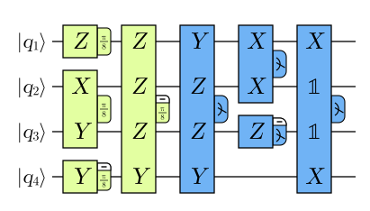

# tzap's PBC format

tzap can export a circuit as a Pauli-based computation (PBC): a list of
Pauli-product rotations and measurements, followed by a Clifford frame.

```bash
tzap input.qasm --to-pbc -o output.pbc
```

The first line of every output is `pbc 0.1`, the format version. A reader should
reject an unknown version; a change to the file syntax or meaning will use a
new version number.

`--to-pbc` turns gate-level optimization off, since PBC has its own: after any
requested decompositions, the circuit is converted, and then the rotation
optimizer lowers the T count by merging same-axis rotations, moving each
rotation past the rotations it commutes with to reach its partner.
Use `--pbc-no-opt` to keep the converted rotations unchanged, or
`--pbc-max-weight N` to limit the weight of π/8 rotations and measurements.
The [weight bound](#weight-bound) section explains how Clifford gates are
emitted when the bound would be exceeded.
To run gate-level optimization first, pass `-O1`–`-O3`, `-Osuper`, or
`--passes`, where conversion is the pass `ToPbc`, listed after the gate passes,
optionally followed by the rotation optimizer `PbcOpt`:

```bash
tzap input.qasm --passes CancelGates,ToPbc,PbcOpt -o output.pbc
```

The input must have no resets; for Rz gates, also pass `--decompose-rotations`.
Measurements may appear anywhere, including mid-circuit. tzap checks these
right after parsing, naming the offending gate, before any other work.

## Report

On stderr, tzap reports the PBC before and after the rotation optimizer: the
number of π/8 rotations and, when there are any, of Clifford rotations (left in
the circuit by a weight bound) and measurements, with the minimum, median, and
maximum weight of each kind. For `benchmarks/feynman/barenco_tof_3.qasm`:

```text
  Converted to PBC in 0.000s
	├─ 28 π/8 rotations
	└─ π/8 weight min/median/max: 1/2/3
  Optimized PBC in 0.000s
	├─ 28 → 16 π/8 rotations (↓42.9%)
	└─ π/8 weight min/median/max: 1/2/3
```

For an even count, the median is the mean of the two middle weights, so it can
end in `.5`. With `-O1`–`-O3` or `--passes`, a gate-level summary comes first;
without them, the parsed circuit's gate metrics are listed under `Parsed`.

Writing, drawing, and measuring PBC expand the shared Pauli axes into explicit
strings. That work is bounded by `--pbc-expansion-budget` (256 million units by
default; the largest benchmark, `gf2^256_mult`, needs about 10 million).
Exceeding it is an error that names the flag.

## Syntax

The required version line comes first. The next two lines declare the number
of qubits and of classical registers, each of which holds one bit:

```text
pbc 0.1
qubits 3
registers 2
```

Qubit IDs and register IDs start at zero. Multiple QASM `qreg`s or `creg`s are
numbered consecutively in declaration order, so with `creg a[1]; creg b[2];`,
`b[1]` becomes `c2`. The remaining lines contain `r` and `m` operations in
execution order, in any interleaving, followed by `f` (frame) records:

```text
r <k> <sign> <Pauli factors>
m <sign> <Pauli factors> -> c<register ID>
f <Xq or Zq> <sign> <Pauli factors>
```

- `r` applies `exp(-i * k*pi/8 * P)`, where `k` is an integer and `P` is the
  signed Pauli product. The exporter uses `k` from -3 through 4; angles differing
  by 8 are equivalent up to global phase.
- `m` measures `P`: eigenvalue +1 writes bit 0; eigenvalue -1 writes bit 1.
- The sign is `1` or `-1`. Signs `i` and `-i` are not allowed: rotation and
  measurement axes must be Hermitian.
- Factors are `X0`, `Y1`, `Z2`, etc., listed in increasing qubit-ID order, with
  each qubit appearing at most once. Omitted qubits carry identity; an empty
  factor list means identity.
- All factors on a line form **one joint operation**, not separate operations.
- Measurements write directly to registers such as `c0`. A later write to the
  same register overwrites its value.
- `f` records specify the output Clifford C, applied after all `r` and `m`
  operations, by its images `C† Xq C` and `C† Zq C`. An omitted row means the
  identity image (`Xq` or `Zq` with sign `1`). Changed X rows come first, then
  changed Z rows, each in increasing q order.

For example, `r 1 -1 X0 Z2` rotates by pi/8 about `-X0 Z2` (equivalently, by
-pi/8 about `X0 Z2`), and `m -1 Z1 -> c0` measures `-Z1`, reversing the outcome
labels of a Z measurement.

The export preserves the full quantum–classical behaviour of the circuit:
measurement results, and the output states of every qubit (the frame restores
them after the measurements).

## Examples

### H followed by measurement

Input: `H q0; measure q0 -> c0`.

```text
pbc 0.1
qubits 1
registers 1
m 1 X0 -> c0
f X0 1 Z0
f Z0 1 X0
```

H changes the measurement axis from Z to X; the frame represents that H.

### Bell preparation and readout

Input: `H q0; CX q0 -> q1; measure q0 -> c0; measure q1 -> c1`.

```text
pbc 0.1
qubits 2
registers 2
m 1 X0 -> c0
m 1 X0 Z1 -> c1
f X0 1 Z0 X1
f Z0 1 X0
f Z1 1 X0 Z1
```

The second measurement is of the joint product `X0 Z1`.

### A mid-circuit measurement followed by a T gate

Input: `H q0; CX q0 -> q1; measure q0 -> c0; T q1; H q1; measure q1 -> c1`.

```text
pbc 0.1
qubits 2
registers 2
m 1 X0 -> c0
r 1 1 X0 Z1
m 1 X1 -> c1
f X0 1 Z0 X1
f X1 1 X0 Z1
f Z0 1 X0
f Z1 1 X1
```

The T gate becomes a rotation about the joint axis `X0 Z1`.

## Weight bound

```bash
tzap input.qasm --to-pbc --pbc-max-weight 1 -o output.pbc
```

bounds the weight (number of qubits acted on) of every π/8 rotation and
measurement by N ≥ 1. Clifford gates normally go into the frame, where they
widen later axes. When an axis would exceed N, the Clifford gates since the
last such point are instead emitted in place as π/4 and π/2 rotations
(`r 2`, `r 4`), and the frame restarts from the identity. Those rotations have
weight at most 2, since an entangling gate needs two qubits. With N below 3,
CCX and CCZ are decomposed into Clifford+T first. Under a bound, the rotation
optimizer keeps Clifford rotations in place rather than moving them into the
frame, so the bound still holds.

For the last example's first four gates (`H q0; CX q0 -> q1; T q1; measure q1
-> c0`), bound 1 gives

```text
pbc 0.1
qubits 2
registers 2
r 2 1 Z0
r 2 1 X0
r 4 1 Z0
r 2 1 X1
r -2 1 Z0 X1
r 1 1 Z1
m 1 Z1 -> c0
```

The first rotations are H (`r 2 Z0; r 2 X0; r 2 Z0`) and CX
(`r 2 Z0; r 2 X1; r -2 Z0 X1`); the optimizer merged the two adjacent `r 2 Z0`
into `r 4 Z0`. The frame is empty. Bound 2 needs no flush and gives the unbounded output (`r 1 1 X0 Z1`,
`m 1 X0 Z1`, and the frame).

## Visualizer

```bash
tzap input.qasm --visualize-pbc circuit.svg
```

draws the PBC circuit as an SVG in the style of Litinski's "A Game of Surface
Codes". Each operation is one box spanning its qubits, with a Pauli letter on
every wire it covers (𝟙 inside the span where it acts trivially). A tab shows
the angle, with a white "−" strip when the axis is negative. π/8 rotations
are green, π/4 orange, π/2 grey, and measurements blue. Operations are drawn
as early as their commutation allows, as in the paper's figures. Every
operation is drawn, however large the circuit.

For example, this circuit (from Fig. 4 of the paper):

```qasm
OPENQASM 2.0;
include "qelib1.inc";
qreg q[4];
creg c[4];
t q[0];
cx q[2],q[1];
h q[3]; sdg q[3]; h q[3];
cx q[1],q[0];
h q[2]; s q[2]; h q[2];
t q[3];
cx q[3],q[0];
t q[0];
s q[1];
t q[2];
s q[3];
h q[0]; sdg q[0]; h q[0];
h q[1]; s q[1]; h q[1];
h q[2]; s q[2]; h q[2];
h q[3]; s q[3]; h q[3];
measure q[0] -> c[0];
measure q[1] -> c[1];
measure q[2] -> c[2];
measure q[3] -> c[3];
```

draws as



Native P/RX/RY/RZ and controlled phase/rotation gates require rotation
decomposition before conversion. Y/SX/SWAP/CY/CH/CSWAP transfer rules are not
implemented; convert these gates to the supported basis first.
